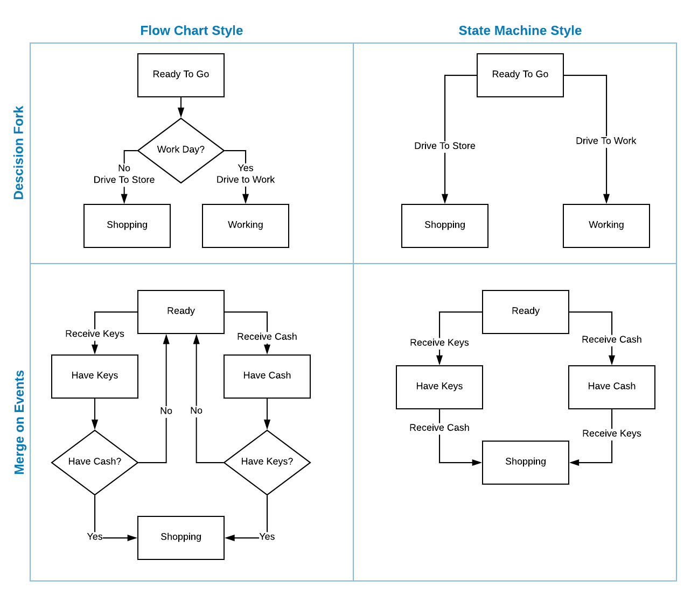

# State Machine

Java implementation of a performance state machine.  There are no threads, no reflection and no frills.  Create a new machine in minutes with the included builder.  If the desire is to use a state machine that does not require a long time to learn and integrate, then this may be the right one.   

There are other robust state machines, but many are to weighted down by their features.  This state machine offers
only essential features in exchange for better performance which much lower overhead.

Design Goals

1. Easy to use
2. Fast
3. Low memory overhead
4. Low CPU overhead

Main Differentiators

1. No reflection: it's slow and should be avoided in performance stages, past configuration time.
2. No *added* threads: threads are useful to deal with recursive state changes, but costs performance and memory.
3. Thin instances: separate the model from the contextual instances yields light and fast virtually unlimited instances.
4. Simple callback model: the more events, the more overhead and slower it becomes.
5. No decision nodes: KISS: Better achieved by having different events off the same state.
6. No guards: KISS: just syntactic sugar making it unnecessarily complicated.
7. No Forks or Merges: KISS: ridiculous complexity that can be avoided by better software and work flow design.


Build status:[](https://travis-ci.org/nofacepress/state-machine)


## Maven Setup

```xml
<dependency>
  <groupId>com.nofacepress</groupId>
  <artifactId>state-machine</artifactId>
  <version>0.2.0</version>
</dependency>
```

## State Machine 101

### Basic Terminology

State machines have just few important parts.

   Term        | Definition
 :---------    | :------------------------------------------------------------------------------- 
 `<S>` *State*   | the current position in a work flow represented by a constant value.              
 `<E>` *Event*   | the trigger that moves from one state to another represented by a constant value. 
 `<C>` *Context* | what the state machine relates to.  This is developer defined.  It could be a database entity, a user, ...   


In a *normal flow*, states can only be changed using events.  While is is possible to force a state change, that is not
the best practice as it does not enforce the proper work flow. 

### Noface Implementation

   Class    | Definition
 :--------- | :------------------------------------------------------------------------------- 
 `StateMachineGraph` | the state machine model.  Defined the states, events, transitions, and state change listeners.               
 `StateMachineInstance` | thin `<C>` *Context* relative instance that tracks state for a single context.  This shares a  read only `StateMachineGraph` with other instances requiring very little memory or overhead.  
 `StateMachineGraphBuilder` | A simplified interface for configuring a `StateMachineGraph` using a builder pattern.
 `StateType` | a unique wrapper for each  `<S>` *State* that adds aggregation of transitions and state specific listeners.
  `ListenerManager` | common container for managing *on change* listeners.  This is aggregated by ``StateMachineGraph` for global listeners and `StateType` for state specific listeners.
 `OnStateChangedListener` | Callback listener for when a state *is* changing.  Further state changes are not allowed from within this listener.  This is ideal for persisting state changes to a database and ensure that it happens before any `AfterStateChangedListener`'s.  The state change limitation exists because it creates use cases ripe code defects and excessive complexity. Use `AfterStateChangedListener` for cases where the state may change within.
`AfterStateChangedListener` | Callback listener for when a state change *has* already happened.  It is safe to make further state changes within this listener.  This is ideal for performing additional events when a state change triggered it.
`StateMachineException` | Runtime exception that can generally only occur on a code defect, or by trying to change state from within an `OnStateChangedListener`.
`SCXMLManager` | Provides an optional method to both load and save a `StateMachineGraph` via the SCXML format.
`PlantUmlManager` | Provides an optional method to save and visualize a `StateMachineGraph` via PlantUml format.


### Simplifing Logic

#### Reduce, reduce, reduce

    A state machine is not subsitute for code!
    
One of the biggest challenges when starting to use a state machine is reducing it to its essential parts.  Think of state machine like a process flow of an online order: ORDERED, PAYMENT_PENDING, PAID, SHIPPED, COMPLETED.  Behind the scenes, the code is doing all kinds of validating, payment processing, and so on.  But the only thing important from a state machine perspective is that the big stuff happens in order.  If something goes wrong, there should be an *event* that fires taking it to the correct next *state*.

#### Doing away with conditionals

Another common issue when creating a new state machine is that the source is a flow chart.  In a state machine, *events* just happen, triggered by something else like user input or reaching a *state*.  The decision of which events to generate is best just left in the code.   The chart below shows some of the differences between a state machine and a flow chart.




## Examples


### Defining a State Machine With Strings

```java
// Note: Person is your bean

StateMachineGraphBuild<String, String, Person> build = StateMachineGraphBuilder.builder();

StateMachineGraph<String, String, Person> graph = build
		.initial("home")
		.transition("home",     "working",   "drove to work")
		.transition("home",     "shopping",  "drove to store")
		.transition("working",  "shopping",  "drove to store")
		.transition("working",  "home",      "drove home")
		.transition("shopping", "home",      "drove home")
		.transition("home",     "sleeping",  "went to bed")
		.build();

```

### Defining a State Machine With Enums

```java
// Note: Person is your bean

enum Location {
	HOME, WORK, STORE, BED; 
}

enum Action {
	DRIVE_HOME, DRIVE_WORK, DRIVE_STORE, GO_TO_BED; 
}

StateMachineGraphBuild<Location, Action, Person> build = StateMachineGraphBuilder.builder();

StateMachineGraph<Location, Action, Person> graph = build
		.initial(Location.HOME)
		.transition(Location.HOME,  Location.WORK,   Action.DRIVE_WORK)
		.transition(Location.HOME,  Location.STORE,  Action.DRIVE_STORE)
		.transition(Location.WORK,  Location.STORE,  Action.DRIVE_STORE)
		.transition(Location.WORK,  Location.HOME,   Action.DRIVE_HOME)
		.transition(Location.STORE, Location.HOME,   Action.DRIVE_HOME)
		.transition(Location.HOME,  Location.BED,    Action.GO_TO_BED)
		.build();

```

### Using a State Machine

#### Create a new instance

This operation is very fast and cheap, don't be afraid to do it for every context.

```
// Person is your bean
Person context user = new Person();

StateMachineInstance<Location, Action, Person> instance = 
					new StateMachineInstance<Location, Action, Person>(graph, user);

```

#### Change the state with an event

```
// Based on the previous example, this will change the state from Location.WORK to Location.WORK

boolean ok = instance.fireEvent(Action.DRIVE_WORK);
```

#### Forcing a state change

```
// This should not normally be used.
// The second and third arguments are for designed what to do with listeners.

instance.forceStateChange(Location.BED, null, false);
```

#### Getting the current state

```
StateType<Location, Action, Person> locInfo = instance.getCurrentState();

System.out.println("Current location is " + locInfo.getId());
```

#### Checking if an event possible in the current state

Checking to see an event is possible is the preferred way of implementing state code as many
events can be reused for multiple transitions between many states.

```
 if(instance.getCurrentState().hasTransition(Action.GO_TO_BED)) {P

	// Get ready for bed
	instance.fireEvent(Action.GO_TO_BED);
 }

```

#### Adding an event listener


```

// Define your listener, use AfterStateChangedListener when making more state changes
class GoToBedListener implements AfterStateChangedListener<Location, Action, Person> {

	@Override
	public void afterStateChanged(
			StateMachineInstance<Location, Action, Person> instance,
			StateType<Location, Action, Person> source,
			StateType<Location, Action, Person> target,
			Action event
	) {
			Person who = instance.getContext();
			
			// Get ready for bed
			instance.fireEvent(Action.GO_TO_BED);
	}
}

// Add it to an existing state graph
graph.getStateType(Location.HOME).getListenerManager().addListener(new GoToBedListener());

// OR: add it while using the builder	
StateMachineGraph<Location, Action, Person> graph = build
		.initial(Location.HOME)
		.transition(Location.HOME,  Location.BED,    Action.GO_TO_BED)
		.listener(Location.HOME, new GoToBedListener())
		.build();


```


#### Persisting State Changes


```

// Define your listener, use OnStateChangedListener to be first in line
class SaveStateListener implements OnStateChangedListener<Location, Action, Person> {

	@Override
	public void afterStateChanged(
			StateMachineInstance<Location, Action, Person> instance,
			StateType<Location, Action, Person> source,
			StateType<Location, Action, Person> target,
			Action event
	) {
			Person who = instance.getContext();

			// save this change in your database
 	      System.out.println("Who: " + who.getLastName() + "From:" + source.getId() + " To:" + target.getId() + " Event:" + event);
	}
}

// Add it to an existing state graph for notification on all states
graph.getListenerManager().addListener(new SaveStateListener());

// OR: add it while using the builder	
StateMachineGraph<Location, Action, Person> graph = build
		.initial(Location.HOME)
		.transition(Location.HOME,  Location.BED,    Action.GO_TO_BED)
		.listener(new SaveStateListener())
		.build();


```

#### Passing extra data in a state machine instance

The `StateMachineInstance` provides `getProperty()` and `setProperty()` methods to include data in addition to the *context*.  This is useful for sharing information between listeners or just bundling extra data with the instance.

### SCXML Importing and Exporting

[SCXML](https://en.wikipedia.org/wiki/SCXML) is a current standard for describing state machines in XML.  The `SCXMLManager` class can be used to both load and save state machine graphs using the XML format.

### PlanetUml Exporting

[PlantUML](http://plantuml.com/) state charts art based on a plain text file. The `PlantUmlManager` class can be used to save state machine graphs for use with PlantUML.
